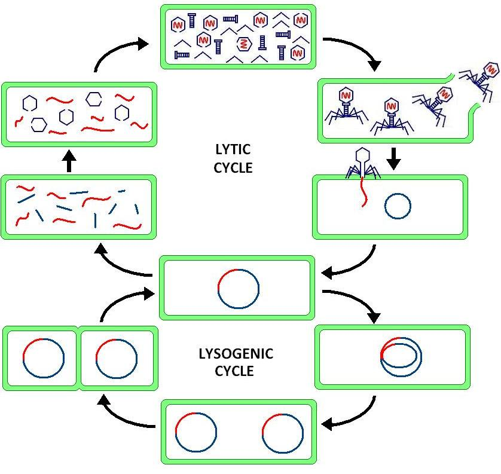

```{r setup ,echo=FALSE}
knitr::opts_chunk$set(message=FALSE, echo=FALSE, eval=FALSE,warning = FALSE)

```

## Introduction

Bacteriophages are the top predators in the bacterial world. They infect bacteria and shape the diversity of the micorbial community. This is comparable to the introduction of top predators such as wolfes and bares in the Yosemite national park. 

Phages not only infect bacteria but they can also have a different functions on their host hosts. For example they can effect the course of the bacterial infection. In fact, based on evolutionary  reasoning,  prophages  are  postulated  to  con-tribute genes that increase the fitness of lysogenic bacteria  their  specific  ecological  niche. 

Phages can have different life cycles. The most well know are the lytic and lysogenic life cycle of phages. in the lysogenic cycle the phage inserts into the host genome and can actively transcribe or excise out of the host again. On the other hand lytic phages do not insert and replicate within the cell without entering the genome. 

{ width=50% }


Phage evolve very quickly and the diversity is tremendously large, thereby the taxonomy is not very simple. It is hard to find commonalities over all phage genomes. Therefore phages are originally identified based on the phage lytic functions, particle structure and nucleotide structure. On the other hand people try to infer molecular phylogenic trees from the few common genes. The Institute that organises the naming of phages is the [International Committee on the Taxonomy of Viruses](https://talk.ictvonline.org/).

Here, we look at the diversity Phages in the assembled Bifido bacteria from social Bees. 
We have two main areas we are focusing on:
1. The Prophages within the assembled Bifido bacteria
2. The CRISPRs (bacterial immunsystem) of the Bifido bacteria

We first start of by looking for prophages within the Bifido bacteria. Prophages are phages that have inserted into the bacterial genomes and piggyback for a while. From time to time they replicate and lyse the bacterial cell by bursting. 

## File preperation

Before we however get going we started of prepering the different genome files for the tools we are intending to use. 
To keep it simple I am also reducing the headers of the genome files to a minimum. 


```{bash }
##----------------------------
##---Transfer to bigmachine
##This is onyl relevant for Vincent Somerville
##----------------------------
scp -r /home/vincent/Desktop/Projects/Bifidos vincent@130.223.51.116:/data/Project/

##----------------------------
##---change name of folders
##----------------------------
genomesss_img=IMG_2791355241
for genomesss_img in $(sed '1d' /data/Project/Bifidos/Genome_dataset/Bifido_Genomes_SAGE_2020_woOutgroups.csv |cut -f 3)
do
genomesss=$(grep -a "${genomesss_img}" /data/Project/Bifidos/Genome_dataset/Bifido_Genomes_SAGE_2020_woOutgroups.csv | cut -f 2)
echo -e "change "${genomesss_img}" to " ${genomesss}

mv /data/Project/Bifidos/Genome_dataset/${genomesss_img}/ /data/Project/Bifidos/Genome_dataset/${genomesss}/

done

##----------------------------
##---merge all fna files
##----------------------------

mkdir -p /data/Project/Bifidos/Genome_dataset/all_Bifido_Genomes
rm /data/Project/Bifidos/Genome_dataset/all_Bifido_Genomes/all_Bifido_genomes_merged_fasta
for genomesss in $(sed '1d' /data/Project/Bifidos/Genome_dataset/Bifido_Genomes_SAGE_2020_woOutgroups.csv |cut -f 2)
do
echo "-----------------------------------------------------"

echo -e "merge " ${genomesss}
#grep "^>" /data/Project/Bifidos/Genome_dataset/${genomesss}/${genomesss}.fna 
sed -e "s/>/>${genomesss}_/g" /data/Project/Bifidos/Genome_dataset/${genomesss}/${genomesss}.fna >> /data/Project/Bifidos/Genome_dataset/all_Bifido_Genomes/all_Bifido_genomes_merged_fasta

sed -e "s/>/>${genomesss}_/g" /data/Project/Bifidos/Genome_dataset/${genomesss}/${genomesss}.fna |sed 's/ /_/g' > /data/Project/Bifidos/Genome_dataset/${genomesss}/${genomesss}_renamed.fna
##----------------------------
###--shortening contig names
##----------------------------
cat /data/Project/Bifidos/Genome_dataset/${genomesss}/${genomesss}_renamed.fna > /data/Project/Bifidos/Genome_dataset/${genomesss}/${genomesss}_renamedContigs.fna
for contigzzz in $(grep ">" /data/Project/Bifidos/Genome_dataset/${genomesss}/${genomesss}_renamed.fna)
do
newcontigzzz=$(echo -e ${contigzzz}|cut -d '_' -f 2,3)
sed -i "s/${contigzzz}/>${newcontigzzz}/g"  /data/Project/Bifidos/Genome_dataset/${genomesss}/${genomesss}_renamedContigs.fna
done


done

grep "^>" /data/Project/Bifidos/Genome_dataset/all_Bifido_Genomes/all_Bifido_genomes_merged_fasta
cd /data/Project/Bifidos/Genome_dataset/all_Bifido_Genomes/
pyfasta split -n 3 /data/Project/Bifidos/Genome_dataset/all_Bifido_Genomes/all_Bifido_genomes_merged_fasta

genomesss=2788500098

sed -e "s/>/>${genomesss}_/g" /data/Project/Bifidos/Genome_dataset/${genomesss}/${genomesss}.fna > /data/Project/Bifidos/Genome_dataset/${genomesss}/${genomesss}_renamed.fna

scp vincent@130.223.51.116:/data/Project/Bifidos/Genome_dataset/2788500098/2788500098_renamed.fna /home/vincent/Desktop/Projects/Bifidos/Genome_dataset/IMG_2788500098/2788500098_renamed.fna
```
## Prophage detection

Here, we aim to annotate Prophages or temperate phages in the bacterial genome. There are multiple different tool to do this. Among the most common ones are: 
- [Virsorter](https://github.com/simroux/VirSorter)
- [Phaster](https://phaster.ca/)
- [Phagefinder](http://phage-finder.sourceforge.net/)

#### Phaster

Because of the simplicity and the high quality of the tool it is always good to start of with Phaster when searching for Prophages. 
Phaster is a great tool that searches via homology for known phage genes and tries to identify and illustrate the boundaries of putative prophages. 
Here we use the online version of [Phaster](https://phaster.ca/). 
However we can also submit via wget. 


```{bash preparation }
##----------------------------
##---bring local
## This step is in order to bring a file or directory to the local
##----------------------------
mkdir -p /home/vincent/Desktop/Projects/Bifidos/Genome_dataset/all_Bifido_Genomes
scp -r vincent@130.223.51.116:/data/Project/Bifidos/Genome_dataset/all_Bifido_Genomes /home/vincent/Desktop/Projects/Bifidos/Genome_dataset/
##----------------------------
##-----Post to phaster.ca
## This is how you post a mutlicontig fasta file (max. 26mb) to phaster
## we can also do this online 
##----------------------------


mkdir -p /home/vincent/Desktop/Projects/Bifidos/01_Phaster/
cd /home/vincent/Desktop/Projects/Bifidos/Genome_dataset/all_Bifido_Genomes/
wget --post-file="all_Bifido_genomes_merged_0.fasta" "http://phaster.ca/phaster_api?contigs=1" -O Output_filename_all_Bifido_genomes_merged_0.txt


mkdir -p /data/Project/Bifidos//01_Phaster/
cd /data/Project/Bifidos/Genome_dataset/all_Bifido_Genomes/
wget --post-file="all_Bifido_genomes_merged_0.fasta" "http://phaster.ca/phaster_api?contigs=1" -O Output_filename_all_Bifido_genomes_merged_0.txt

```

## Virsorter

A slightly more complicated and extensive tool for prophage annotation is [Virsorter](https://peerj.com/articles/985/) 
Virsorter however does not have an online version and the installation is rather tedious. 
Here, I run Virsorter on the all samples. Additionally, I parse the output file to get all the necassary annotation files that are produced by Virsorter. 

```{bash}

for sample in $(sed '1d' /data/Project/Bifidos/Genome_dataset/Bifido_Genomes_SAGE_2020_woOutgroups.csv |cut -f 2 )
do
#sample=1
threads=35
Overall_output_directory=/data/Project/Bifidos/03_ProphageDectection/Virsorter/${sample}/


echo "========================================="
echo $sample
echo "========================================="
grep ">" /data/Project/Bifidos/Genome_dataset/${sample}/${sample}_renamedContigs.fna |head -2

  rm -r /data/Project/Bifidos/03_ProphageDectection/Virsorter/${sample}/
  mkdir -p /data/Project/Bifidos/03_ProphageDectection/Virsorter/${sample}/
 
source activate /home/vincent/miniconda2/envs/virsorter
/usr/bin/perl /home/vincent/apps/Virsorter/VirSorter/wrapper_phage_contigs_sorter_iPlant.pl \
    -f /data/Project/Bifidos/Genome_dataset/${sample}/${sample}_renamedContigs.fna \
    --db 1 \
    --no_c \
    --wdir /data/Project/Bifidos/03_ProphageDectection/Virsorter/${sample}/ --ncpu ${threads} --data-dir /archiv/VirSorter/virsorter-data

grep -v "^#" /data/Project/Bifidos/03_ProphageDectection/Virsorter/${sample}//VIRSorter_global-phage-signal.csv 
 
 
 done #samples


 ##------------------------------------------------------------------
 ##parse the output file
 ##------------------------------------------------------------------

grep "## Contig_id" /data/Project/Bifidos/03_ProphageDectection/Virsorter/2791355241/VIRSorter_global-phage-signal.csv |head -1 |sed 's/^## //g'|awk -F "," '{OFS=","}{print $0,"phageType","certainty","strain"}' > /data/Project/Bifidos/03_ProphageDectection/Virsorter/VIRSorter_global-phage-signal_cleaned_all.csv
for sample in $(sed '1d' /data/Project/Bifidos/Genome_dataset/Bifido_Genomes_SAGE_2020_woOutgroups.csv |cut -f 2)
do
#sample=1
threads=35
Overall_output_directory=/data/Project/Bifidos/03_ProphageDectection/Virsorter/${sample}/


echo "========================================="
echo $sample
echo "========================================="
grep "## Contig_id" /data/Project/Bifidos/03_ProphageDectection/Virsorter/${sample}/VIRSorter_global-phage-signal.csv |head -1 |sed 's/^## //g'|awk -F "," '{OFS=","}{print $0,"phageType","certainty","strain"}' > /data/Project/Bifidos/03_ProphageDectection/Virsorter/${sample}/VIRSorter_global-phage-signal_cleaned.csv

startNum=1
EndNum=2

for startNum in $(seq 6)
do
 EndNum=$((startNum+1))
 

phageTypess=$(grep "## " /data/Project/Bifidos/03_ProphageDectection/Virsorter/${sample}/VIRSorter_global-phage-signal.csv| grep "## Contig_id" -v| sed -n ${startNum}p|awk -F " - " '{print $2}')
Certaintiesss=$(grep "## " /data/Project/Bifidos/03_ProphageDectection/Virsorter/${sample}/VIRSorter_global-phage-signal.csv| grep "## Contig_id" -v| sed -n ${startNum}p|awk -F " - " '{print $3}')


 sed -n "/## ${startNum}/,/## ${EndNum}/p" /data/Project/Bifidos/03_ProphageDectection/Virsorter/${sample}/VIRSorter_global-phage-signal.csv | grep -v "^##" |awk -F "," -v phageTypzz="$phageTypess" -v Certaintiezz="$Certaintiesss" -v strainzz="$sample" '{OFS=","}{print $0,phageTypzz,Certaintiezz,strainzz}' >> /data/Project/Bifidos/03_ProphageDectection/Virsorter/${sample}/VIRSorter_global-phage-signal_cleaned.csv
  

 done 

 grep "^Contig" -v /data/Project/Bifidos/03_ProphageDectection/Virsorter/${sample}/VIRSorter_global-phage-signal_cleaned.csv >> /data/Project/Bifidos/03_ProphageDectection/Virsorter/VIRSorter_global-phage-signal_cleaned_all.csv
 
 
 done #samples
 
```

move the results local
```{bash}
mkdir -p /home/vincent/Desktop/Projects/Bifidos/03_ProphageDectection/Virsorter
scp -r  vincent@130.223.51.116:/data/Project/Bifidos/03_ProphageDectection/Virsorter/VIRSorter_global-phage-signal_cleaned_all.csv /home/vincent/Desktop/Projects/Bifidos/03_ProphageDectection/Virsorter/

```

```{r}
library(readr)
library(tidyverse)

VIRSorter_global_phage_signal_cleaned_all <- read_csv("~/Desktop/Projects/Bifidos/03_ProphageDectection/Virsorter/VIRSorter_global-phage-signal_cleaned_all.csv")


table(VIRSorter_global_phage_signal_cleaned_all$certainty,VIRSorter_global_phage_signal_cleaned_all$phageType)


virsorter_socialBeeStrains <- VIRSorter_global_phage_signal_cleaned_all[which(VIRSorter_global_phage_signal_cleaned_all$Contig_id %in% c("VIRSorter_Ga0401710_01","VIRSorter_Ga0401710_02","VIRSorter_Ga0401710_03","VIRSorter_Ga0401716_01","VIRSorter_Ga0401713_02","VIRSorter_Ga0401713_04","VIRSorter_Ga0401715_02")),]
# VIRSorter_global_phage_signal_cleaned_all %>% filter(("2842527608","2842539502","2842533815","2842546669","2842537873")
table(virsorter_socialBeeStrains$certainty,virsorter_socialBeeStrains$phageType)


write.csv(virsorter_socialBeeStrains,file="~/Desktop/Projects/Bifidos/03_ProphageDectection/Virsorter/VIRSorter_global-phage-signal_cleaned_onlyStrains.csv",quote = FALSE)

###------------filter for only categroy 1 (sure) contigs

VIRSorter_contigs <- VIRSorter_global_phage_signal_cleaned_all %>% filter(certainty=="category 1 (sure)")
table(VIRSorter_contigs$certainty,VIRSorter_contigs$phageType)

VIRSorter_contigs
```


#### VirFam

[VirFam](http://biodev.cea.fr/virfam/) is an excilent online resource that annotates the morophogenes of phages and makes a first taxonomic classification.
In order to submit to Virfam we have to extract 
First we need to extract all proteins fasta files created by Virsorter in order to submit to Virfam.
```{bash}
##============================
###location Prophages in genome
##============================
sample=2684622918

rm -r /data/Project/Bifidos/03_ProphageDectection/Virsorter/all_strains_social/${sample}
rm -r /data/Project/Bifidos/03_ProphageDectection/Virsorter/all_strains_social/complete_Phage_list.txt
for sample in $(sed '1d' /data/Project/Bifidos/Genome_dataset/Bifido_Genomes_SAGE_2020_woOutgroups.csv |cut -f 2)
do
rm -r /data/Project/Bifidos/03_ProphageDectection/Virsorter/${sample}/Predicted_viral_sequences/merged/
mkdir -p /data/Project/Bifidos/03_ProphageDectection/Virsorter/${sample}/Predicted_viral_sequences/merged/


for phagezzz in $(grep ">" /data/Project/Bifidos/03_ProphageDectection/Virsorter/${sample}/Predicted_viral_sequences/*.fasta|cut -d '>' -f 2)
do
genome=$(echo ${phagezzz} |cut -d '_' -f 2,3)
genomeStart=$(echo ${phagezzz} |cut -d '-' -f 2)
genomeEND=$(echo ${phagezzz} |cut -d '-' -f 3)

rm -r /data/Project/Bifidos/03_ProphageDectection/Virsorter/all_strains_social/${sample}/${phagezzz}
mkdir -p /data/Project/Bifidos/03_ProphageDectection/Virsorter/all_strains_social/${sample}/${phagezzz}

echo -e ${genome}"\t"${genomeStart}"\t"${genomeEND}"\t"${phagezzz} >  /data/Project/Bifidos/03_ProphageDectection/Virsorter/all_strains_social/${sample}/${phagezzz}/${phagezzz}.bed

echo -e ${genome}"\t"${genomeStart}"\t"${genomeEND}"\t"${phagezzz} >> /data/Project/Bifidos/03_ProphageDectection/Virsorter/all_strains_social/complete_Phage_list.txt

done #phagezzz
done #sample

##============================
###extract fasta of phages
##============================

sample=2684622918
for sample in $(sed '1d' /data/Project/Bifidos/Genome_dataset/Bifido_Genomes_SAGE_2020_woOutgroups.csv |cut -f 2)
do
rm -r /data/Project/Bifidos/03_ProphageDectection/Virsorter/${sample}/Predicted_viral_sequences/merged/
mkdir -p /data/Project/Bifidos/03_ProphageDectection/Virsorter/${sample}/Predicted_viral_sequences/merged/

cat /data/Project/Bifidos/03_ProphageDectection/Virsorter/${sample}/Predicted_viral_sequences/*.fasta > /data/Project/Bifidos/03_ProphageDectection/Virsorter/${sample}/Predicted_viral_sequences/merged/${sample}_merged.fasta


for phagezzz in $(grep "^>" /data/Project/Bifidos/03_ProphageDectection/Virsorter/${sample}/Predicted_viral_sequences/merged/${sample}_merged.fasta |sed 's/>//g' |cut -d ' ' -f 1)
do
#rm -r /data/Project/Bifidos/03_ProphageDectection/Virsorter/all_strains_social/${sample}/${phagezzz}
#mkdir -p /data/Project/Bifidos/03_ProphageDectection/Virsorter/all_strains_social/${sample}/${phagezzz}

samtools faidx /data/Project/Bifidos/03_ProphageDectection/Virsorter/${sample}/Predicted_viral_sequences/merged/${sample}_merged.fasta ${phagezzz} > /data/Project/Bifidos/03_ProphageDectection/Virsorter/all_strains_social/${sample}/${phagezzz}/${phagezzz}.fna


done #phagezzz
done #sample


##============================
###faa
##============================


for sample in $(sed '1d' /data/Project/Bifidos/Genome_dataset/Bifido_Genomes_SAGE_2020_woOutgroups_onlySequenced.csv |cut -f 3)
do
echo ${sample}

### amino acid
mkdir -p /data/Project/Bifidos/03_ProphageDectection/Virsorter/${sample}/Predicted_viral_sequences/tmpFAA
cd /data/Project/Bifidos/03_ProphageDectection/Virsorter/${sample}/Predicted_viral_sequences/

cat VIRSorter*.gb > VIRSorter_prophages_cat-all.genbank
python2 /home/vincent/apps/genbank_to_fasta_v1.2/genbank_to_fasta.py -i VIRSorter_prophages_cat-all.genbank -o tmpFAA/tmp.faa -s aa

#python2 /home/vincent/apps/genbank_to_fasta_v1.2/genbank_to_fasta.py -i VIRSorter_prophages_cat-4.gb -o tmp.faa -s aa
#python2 /home/vincent/apps/genbank_to_fasta_v1.2/genbank_to_fasta.py -i VIRSorter_prophages_cat-5.gb -o tmp_2.faa -s aa
#python2 /home/vincent/apps/genbank_to_fasta_v1.2/genbank_to_fasta.py -i VIRSorter_prophages_cat-6.gb -o tmp_3.faa -s aa

for phagezzzShort in $(grep "^>" /data/Project/Bifidos/03_ProphageDectection/Virsorter/${sample}/Predicted_viral_sequences/tmpFAA/tmp.faa |awk -F " | " '{print $1}' |sed 's/>//g' |sed 's/VIRSorter_//g' |cut -d '_' -f 1,2|sort|uniq) 
do
phagezzz=$(grep "${phagezzzShort}" /data/Project/Bifidos/03_ProphageDectection/Virsorter/all_strains_social/complete_Phage_list.txt|cut -f 4)
rm -r /data/Project/Bifidos/03_ProphageDectection/Virsorter/all_strains_social/${sample}/${phagezzz}/${phagezzz}.faa 

for geness in $(grep "^>" /data/Project/Bifidos/03_ProphageDectection/Virsorter/${sample}/Predicted_viral_sequences/tmpFAA/tmp.faa |grep "${phagezzzShort}" |awk -F " | " '{print $1}' |sed 's/>//g' )
do

#contigss=$(echo ${geness} |sed 's/>VIRSorter_//g' |awk -F "_" '{print $1}')
genessname=$(echo ${geness} |sed 's/>VIRSorter_//g' |awk -F "_gene" '{print $2}'|sed 's/_/gene_/g')
mkdir -p /data/Project/Bifidos/03_ProphageDectection/Virsorter/all_strains_social/${sample}/${phagezzz}/FAA/
samtools faidx /data/Project/Bifidos/03_ProphageDectection/Virsorter/${sample}/Predicted_viral_sequences/tmpFAA/tmp.faa
samtools faidx /data/Project/Bifidos/03_ProphageDectection/Virsorter/${sample}/Predicted_viral_sequences/tmpFAA/tmp.faa ${geness} > /data/Project/Bifidos/03_ProphageDectection/Virsorter/all_strains_social/${sample}/${phagezzz}/FAA/${genessname}.faa
cat /data/Project/Bifidos/03_ProphageDectection/Virsorter/all_strains_social/${sample}/${phagezzz}/FAA/${genessname}.faa >> /data/Project/Bifidos/03_ProphageDectection/Virsorter/all_strains_social/${sample}/${phagezzz}/${phagezzz}.faa 

done #geness
mkdir -p /data/Project/Bifidos/03_ProphageDectection/Virsorter/all_strains_social/OurBifidoPhages/FAA/
mkdir -p /data/Project/Bifidos/03_ProphageDectection/Virsorter/all_strains_social/OurBifidoPhages/FNA/
cat /data/Project/Bifidos/03_ProphageDectection/Virsorter/all_strains_social/${sample}/${phagezzz}/${phagezzz}.faa > /data/Project/Bifidos/03_ProphageDectection/Virsorter/all_strains_social/OurBifidoPhages/FAA/${phagezzz}.faa

cat /data/Project/Bifidos/03_ProphageDectection/Virsorter/all_strains_social/${sample}/${phagezzz}/${phagezzz}.fna > /data/Project/Bifidos/03_ProphageDectection/Virsorter/all_strains_social/OurBifidoPhages/FNA/${phagezzz}.fna
done #phagezzzShort
done # sample
cat /data/Project/Bifidos/03_ProphageDectection/Virsorter/all_strains_social/OurBifidoPhages/FNA/*.fna > /data/Project/Bifidos/03_ProphageDectection/Virsorter/all_strains_social/OurBifidoPhages/FNA/merged_all_Bifido_phages.fasta


##============================
###GBF
##============================
rm -r /data/Project/Bifidos/03_ProphageDectection/Virsorter/all_strains_social/OurBifidoPhages/GBF/
mkdir -p /data/Project/Bifidos/03_ProphageDectection/Virsorter/all_strains_social/OurBifidoPhages/GBF/
for sample in $(sed '1d' /data/Project/Bifidos/Genome_dataset/Bifido_Genomes_SAGE_2020_woOutgroups_onlySequenced.csv |cut -f 3
do
echo ${sample}
### amino acid
#mkdir -p /data/Project/Bifidos/03_ProphageDectection/Virsorter/${sample}/Predicted_viral_sequences/tmpFAA
cd /data/Project/Bifidos/03_ProphageDectection/Virsorter/${sample}/Predicted_viral_sequences/
#cat VIRSorter*.gb > VIRSorter_prophages_cat-all.genbank
length=$(grep "^LOCUS" VIRSorter_prophages_cat-all.genbank |wc -l)
if [ ${length} == "1" ]; then
namezzz=$(grep "^LOCUS" VIRSorter_prophages_cat-all.genbank |awk '{print $2}') 
echo -e "only one phage: " ${namezzz}
cat VIRSorter_prophages_cat-all.genbank > /data/Project/Bifidos/03_ProphageDectection/Virsorter/all_strains_social/OurBifidoPhages/GBF/${namezzz}.gb
  elif [[ ${length} == "3"  ]]
            then
echo  "Three phages"
namezzz1=$(grep "^LOCUS" VIRSorter_prophages_cat-all.genbank |head -1 |awk '{print $2}') 
namezzz2=$(grep "^LOCUS" VIRSorter_prophages_cat-all.genbank |head -2 |tail -1| awk '{print $2}') 
namezzz3=$(grep "^LOCUS" VIRSorter_prophages_cat-all.genbank |tail -1| awk '{print $2}') 
Extracss1=$(grep "^LOCUS" VIRSorter_prophages_cat-all.genbank |head -1 ) 
Extracss2=$(grep "^LOCUS" VIRSorter_prophages_cat-all.genbank |head -2| tail -1)
Extracss3=$(grep "^LOCUS" VIRSorter_prophages_cat-all.genbank |head -1 ) 
echo -e "Extracting Phage 1: " ${namezzz1}
#sed -n "/$namezzz1$/,/$namezzz2$/p" VIRSorter_prophages_cat-all.genbank > /data/Project/Bifidos/03_ProphageDectection/Virsorter/all_strains_social/OurBifidoPhages/GBF/${namezzz1}.gb
sed -n "/LOCUS *$namezzz1/,/LOCUS *$namezzz2/p" VIRSorter_prophages_cat-all.genbank|head -n -1 > /data/Project/Bifidos/03_ProphageDectection/Virsorter/all_strains_social/OurBifidoPhages/GBF/${namezzz1}.gb
#sed -n "/LOCUS\t$namezzz1/,/LOCUS\t$namezzz2/p" VIRSorter_prophages_cat-all.genbank 
#sed -n "/$namezzz2/,/$namezzz3/p" VIRSorter_prophages_cat-all.genbank |head -1
#head -n -1 #remove last line
echo -e "Extracting Phage 2: " ${namezzz2}
sed -n "/LOCUS *$namezzz2/,/LOCUS *$namezzz3/p" VIRSorter_prophages_cat-all.genbank|head -n -1 > /data/Project/Bifidos/03_ProphageDectection/Virsorter/all_strains_social/OurBifidoPhages/GBF/${namezzz2}.gb
#head -n -1 #remove last line       
echo -e "Extracting Phage 3: " ${namezzz3}
sed -n "/LOCUS *$namezzz3/,/Extracss3/p" VIRSorter_prophages_cat-all.genbank > /data/Project/Bifidos/03_ProphageDectection/Virsorter/all_strains_social/OurBifidoPhages/GBF/${namezzz3}.gb
#head -n -1 #remove last line  
            elif [[ ${length} == "2"  ]]
            then
            echo  "Two phages"
namezzz1=$(grep "^LOCUS" VIRSorter_prophages_cat-all.genbank |head -1 |awk '{print $2}') 
namezzz2=$(grep "^LOCUS" VIRSorter_prophages_cat-all.genbank |tail -1| awk '{print $2}') 
Extracss1=$(grep "^LOCUS" VIRSorter_prophages_cat-all.genbank |head -1 ) 
Extracss2=$(grep "^LOCUS" VIRSorter_prophages_cat-all.genbank |tail -1)
echo -e "Extracting Phage 1: " ${namezzz1}
sed -n "/LOCUS *$namezzz1/,/LOCUS *$namezzz2/p" VIRSorter_prophages_cat-all.genbank |head -n -1> /data/Project/Bifidos/03_ProphageDectection/Virsorter/all_strains_social/OurBifidoPhages/GBF/${namezzz1}.gb
 #head -n -1 #remove last line
 echo -e "Extracting Phage 2: " ${namezzz2}
 sed -n "/LOCUS *$namezzz2/,/Extracss2/p" VIRSorter_prophages_cat-all.genbank > /data/Project/Bifidos/03_ProphageDectection/Virsorter/all_strains_social/OurBifidoPhages/GBF/${namezzz2}.gb
 #head -n -1 #remove last line
          
             else
                echo "no Phage"
                
                
             fi
 done # sample

##============================
###bacterial genomes
##============================

rm -r /data/Project/Bifidos/03_ProphageDectection/Virsorter/all_strains_social/OurBifidoPhages/BacterialGenomes/
mkdir -p /data/Project/Bifidos/03_ProphageDectection/Virsorter/all_strains_social/OurBifidoPhages/BacterialGenomes/

for sample in $(sed '1d' /data/Project/Bifidos/Genome_dataset/Bifido_Genomes_SAGE_2020_woOutgroups_onlySequenced.csv |cut -f 3 )
do


echo "========================================="
echo $sample
echo "========================================="

cat /data/Project/Bifidos/Genome_dataset/${sample}/${sample}_renamedContigs.fna > /data/Project/Bifidos/03_ProphageDectection/Virsorter/all_strains_social/OurBifidoPhages/BacterialGenomes/${sample}_renamedContigs.fna
 
 done #samples
 
 
##============================
###Virsorter genes list
##============================
 
 
rm -r /data/Project/Bifidos/03_ProphageDectection/Virsorter/all_strains_social/OurBifidoPhages/geneDescription/
mkdir -p /data/Project/Bifidos/03_ProphageDectection/Virsorter/all_strains_social/OurBifidoPhages/geneDescription/
for sample in $(sed '1d' /data/Project/Bifidos/Genome_dataset/Bifido_Genomes_SAGE_2020_woOutgroups_onlySequenced.csv |cut -f 3)
do
echo ${sample}

for phagezzzShort in $(grep "^>" /data/Project/Bifidos/03_ProphageDectection/Virsorter/${sample}/Predicted_viral_sequences/tmpFAA/tmp.faa |awk -F " | " '{print $1}' |sed 's/>//g' |sed 's/VIRSorter_//g' |cut -d '_' -f 1,2|sort|uniq) 
do
phagezzz=$(grep "${phagezzzShort}" /data/Project/Bifidos/03_ProphageDectection/Virsorter/all_strains_social/complete_Phage_list.txt|cut -f 4)
#rm -r /data/Project/Bifidos/03_ProphageDectection/Virsorter/all_strains_social/${sample}/${phagezzz}/${phagezzz}.faa 


#contig name
grep "^>" /data/Project/Bifidos/03_ProphageDectection/Virsorter/${sample}/Predicted_viral_sequences/tmpFAA/tmp.faa |grep "${phagezzzShort}" |sed 's/>//g' |awk -F "|" '{OFS="\t"}{print $1}'  > /data/Project/Bifidos/03_ProphageDectection/Virsorter/all_strains_social/OurBifidoPhages/geneDescription/tmp_01.txt
phageNameShort=$(cut -f 1 /data/Project/Bifidos/03_ProphageDectection/Virsorter/all_strains_social/OurBifidoPhages/geneDescription/tmp_01.txt |sort| uniq)
sed -i 's/${phageNameShort}/${phagezzz}/g' /data/Project/Bifidos/03_ProphageDectection/Virsorter/all_strains_social/OurBifidoPhages/geneDescription/tmp_01.txt


#gene prediction
grep "^>" /data/Project/Bifidos/03_ProphageDectection/Virsorter/${sample}/Predicted_viral_sequences/tmpFAA/tmp.faa |grep "${phagezzzShort}" |sed 's/>//g' |awk -F "|" '{OFS="\t"}{print $3}' |sed 's/^ //g' > /data/Project/Bifidos/03_ProphageDectection/Virsorter/all_strains_social/OurBifidoPhages/geneDescription/tmp_03.txt

#location
grep "^>" /data/Project/Bifidos/03_ProphageDectection/Virsorter/${sample}/Predicted_viral_sequences/tmpFAA/tmp.faa |grep "${phagezzzShort}" |sed 's/>//g' |awk -F "|" '{OFS="\t"}{print $4}' | awk -F "[ :]" '{OFS="\t"}{print $2,$3,$4}' |sed 's/Reverse/-/g' |sed 's/Forward/+/g'  > /data/Project/Bifidos/03_ProphageDectection/Virsorter/all_strains_social/OurBifidoPhages/geneDescription/tmp_02.txt
  
##merge  
paste /data/Project/Bifidos/03_ProphageDectection/Virsorter/all_strains_social/OurBifidoPhages/geneDescription/tmp_01.txt \
/data/Project/Bifidos/03_ProphageDectection/Virsorter/all_strains_social/OurBifidoPhages/geneDescription/tmp_02.txt \
/data/Project/Bifidos/03_ProphageDectection/Virsorter/all_strains_social/OurBifidoPhages/geneDescription/tmp_03.txt > /data/Project/Bifidos/03_ProphageDectection/Virsorter/all_strains_social/OurBifidoPhages/geneDescription/${phagezzz}.txt

done #phagezzzShort
done # sample
rm /data/Project/Bifidos/03_ProphageDectection/Virsorter/all_strains_social/OurBifidoPhages/geneDescription/tmp*
cat /data/Project/Bifidos/03_ProphageDectection/Virsorter/all_strains_social/OurBifidoPhages/geneDescription/*.txt > /data/Project/Bifidos/03_ProphageDectection/Virsorter/all_strains_social/OurBifidoPhages/geneDescription/All_genes.description

 
 
```


```{bash}
#move the phages local
mkdir -p ~/Desktop/Projects/Bifidos/03_ProphageDectection/Virsorter/all_strains_social/
scp -r vincent@130.223.51.116:/data/Project/Bifidos/03_ProphageDectection/Virsorter/all_strains_social/OurBifidoPhages/ ~/Desktop/Projects/Bifidos/03_ProphageDectection/Virsorter/all_strains_social/

```


```{r}
library(readr)
library(tidyverse)
dir("~/Desktop/Projects/Bifidos/03_ProphageDectection/Virsorter/all_strains_social/OurBifidoPhages/Coverage_genomes/")
X2842527608_Phage_locations <- read_delim("~/Desktop/Projects/Bifidos/03_ProphageDectection/Virsorter/all_strains_social/OurBifidoPhages/Coverage_genomes/2842527608_Phage_locations.bed","\t", escape_double = FALSE, col_names = c("ContigName","StartPhage","EndPhage","PhageName"),  trim_ws = TRUE)

all_Phage_locations <- read_delim("~/Desktop/Projects/Bifidos/03_ProphageDectection/Virsorter/all_strains_social/OurBifidoPhages/Coverage_genomes/All_phage_location.txt","\t", escape_double = FALSE, col_names = c("ContigName","StartPhage","EndPhage","PhageName"),  trim_ws = TRUE)

X2842527608_Phage_locations$StartPhage_extended <- X2842527608_Phage_locations$StartPhage-4000
X2842527608_Phage_locations$EndPhage_extended <- X2842527608_Phage_locations$EndPhage+4000

X2842527608_depth <- read_delim("~/Desktop/Projects/Bifidos/03_ProphageDectection/Virsorter/all_strains_social/OurBifidoPhages/Coverage_genomes/2842527608_depth.txt",  "\t", escape_double = FALSE, col_names = c("ContigName","Nucleotide","Coverage"),   trim_ws = TRUE)

##-----------------
##phage 1
##-----------------

X2842527608_depth_phage_01_data <- X2842527608_depth %>% filter(ContigName=="Ga0401710_01") %>%  filter(Nucleotide>464114) %>%  filter(Nucleotide<502671)

ggplot(X2842527608_depth_phage_01_data,aes(x=Nucleotide,y=Coverage))+geom_line()+geom_vline(xintercept =c(468114,498671))

```


##Mapping coverage 

In order to see if the putative prophages are active we look at the sequencing coverage. If a phage is active we would expect it to have an different coverage in comparison to the host genome. 
Therefore we will look what the read coverage is at the site of the prophages. To do this we need to first map the raw reads to the reference genome. 

```{bash}
##==============================
##------------------move from local
##==============================
scp /home/vincent/Desktop/Projects/Bifidos/Genome_dataset/Bifido_Genomes_SAGE_2020_woOutgroups_onlySequenced.csv vincent@130.223.51.116:/data/Project/Bifidos/Genome_dataset/

scp /run/user/1000/gvfs/smb-share:server=nas.unil.ch,share=fbm,user=ad%5Cvsomervi/DMF/GROUPS/gr_Engel/lab_resources/NGS_data/Genomes/190927_SAGE_MiniSeq/Fastq/1_*.fastq.gz vincent@130.223.51.116:/data/Project/Bifidos/rawData
scp /run/user/1000/gvfs/smb-share:server=nas.unil.ch,share=fbm,user=ad%5Cvsomervi/DMF/GROUPS/gr_Engel/lab_resources/NGS_data/Genomes/190927_SAGE_MiniSeq/Fastq/7_*.fastq.gz vincent@130.223.51.116:/data/Project/Bifidos/rawData
scp /run/user/1000/gvfs/smb-share:server=nas.unil.ch,share=fbm,user=ad%5Cvsomervi/DMF/GROUPS/gr_Engel/lab_resources/NGS_data/Genomes/190927_SAGE_MiniSeq/Fastq/4_*.fastq.gz vincent@130.223.51.116:/data/Project/Bifidos/rawData
scp /run/user/1000/gvfs/smb-share:server=nas.unil.ch,share=fbm,user=ad%5Cvsomervi/DMF/GROUPS/gr_Engel/lab_resources/NGS_data/Genomes/190927_SAGE_MiniSeq/Fastq/12_*.fastq.gz vincent@130.223.51.116:/data/Project/Bifidos/rawData
scp /run/user/1000/gvfs/smb-share:server=nas.unil.ch,share=fbm,user=ad%5Cvsomervi/DMF/GROUPS/gr_Engel/lab_resources/NGS_data/Genomes/190927_SAGE_MiniSeq/Fastq/6_*.fastq.gz vincent@130.223.51.116:/data/Project/Bifidos/rawData
```


```{bash}
##==============================
##------------------rename
##==============================
rm -r /data/Project/Bifidos/rawData/renamed
mkdir -p /data/Project/Bifidos/rawData/renamed
for genomesss in $(sed '1d' /data/Project/Bifidos/Genome_dataset/Bifido_Genomes_SAGE_2020_woOutgroups_onlySequenced.csv |cut -f 3)
do
echo ${genomesss}
strainPick=$(grep "${genomesss}"  /data/Project/Bifidos/Genome_dataset/Bifido_Genomes_SAGE_2020_woOutgroups_onlySequenced.csv |cut -f 1)
echo ${strainPick}

for readzz in $(echo "R1 R2")
do

cat /data/Project/Bifidos/rawData/${strainPick}_*_${readzz}_*.fastq.gz > /data/Project/Bifidos/rawData/renamed/${genomesss}_${readzz}.fastq.gz
done #readzz
done #genomesss

```


```{bash}
##==============================
#### rawRead mapping
##==============================

threads=35
rm -r /data/Project/Bifidos/04_GenomeCoverage
for genomesss in $(sed '1d' /data/Project/Bifidos/Genome_dataset/Bifido_Genomes_SAGE_2020_woOutgroups_onlySequenced.csv |cut -f 3)
do

##--------------create directories----------------

mkdir -p /data/Project/Bifidos/04_GenomeCoverage/bwaMapping/${genomesss}/bamqc
mkdir -p /data/Project/Bifidos/rawData/renamed/fq/
mkdir -p /data/Project/Bifidos/04_GenomeCoverage/Coverage/

##--------------unzip files---------------

 gunzip -c /data/Project/Bifidos/rawData/renamed/${genomesss}_R1.fastq.gz > \
  /data/Project/Bifidos/rawData/renamed/fq/${genomesss}_R1.fastq
 gunzip -c /data/Project/Bifidos/rawData/renamed/${genomesss}_R2.fastq.gz > \
  /data/Project/Bifidos/rawData/renamed/fq/${genomesss}_R1.fastq

reference_fasta=/data/Project/Bifidos/Genome_dataset/${genomesss}/${genomesss}_renamedContigs.fna
bwa index $reference_fasta

bwa mem -t ${threads}  $reference_fasta /data/Project/Bifidos/rawData/renamed/fq/${genomesss}_R1.fastq /data/Project/Bifidos/rawData/renamed/fq/${genomesss}_R1.fastq |samtools sort -@8 -O BAM \
-o /data/Project/Bifidos/04_GenomeCoverage/bwaMapping/${genomesss}/rawIllumina_${genomesss}_bwamem_Assembly_sorted.bam - 
     
samtools depth -a /data/Project/Bifidos/04_GenomeCoverage/bwaMapping/${genomesss}/rawIllumina_${genomesss}_bwamem_Assembly_sorted.bam >  /data/Project/Bifidos/04_GenomeCoverage/Coverage/${genomesss}_depth.txt

qualimap bamqc -bam /data/Project/Bifidos/04_GenomeCoverage/bwaMapping/${genomesss}/rawIllumina_${genomesss}_bwamem_Assembly_sorted.bam \
        -outdir /data/Project/Bifidos/04_GenomeCoverage/bwaMapping/${genomesss}/bamqc --java-mem-size=40G
    
done #genomesss

##==============================
#get phage location
##==============================
rm /data/Project/Bifidos/04_GenomeCoverage/Coverage/*_Phage_locations.bed
for sample in $(sed '1d' /data/Project/Bifidos/Genome_dataset/Bifido_Genomes_SAGE_2020_woOutgroups_onlySequenced.csv |cut -f 3)
do
rm -r /data/Project/Bifidos/03_ProphageDectection/Virsorter/${sample}/Predicted_viral_sequences/merged/
mkdir -p /data/Project/Bifidos/03_ProphageDectection/Virsorter/${sample}/Predicted_viral_sequences/merged/

for phagezzz in $(grep ">" /data/Project/Bifidos/03_ProphageDectection/Virsorter/${sample}/Predicted_viral_sequences/*.fasta|cut -d '>' -f 2)
do
genome=$(echo ${phagezzz} |cut -d '_' -f 2,3)
genomeStart=$(echo ${phagezzz} |cut -d '-' -f 2)
genomeEND=$(echo ${phagezzz} |cut -d '-' -f 3)

echo -e ${genome}"\t"${genomeStart}"\t"${genomeEND}"\t"${phagezzz} >> /data/Project/Bifidos/04_GenomeCoverage/Coverage/${sample}_Phage_locations.bed

done #phagezzz
done #sample


for genomesss in $(sed '1d' /data/Project/Bifidos/Genome_dataset/Bifido_Genomes_SAGE_2020_woOutgroups_onlySequenced.csv |cut -f 3)
do
mkdir -p /data/Project/Bifidos/03_ProphageDectection/Virsorter/all_strains_social/OurBifidoPhages/Coverage_genomes/
cat /data/Project/Bifidos/04_GenomeCoverage/Coverage/${genomesss}_depth.txt > /data/Project/Bifidos/03_ProphageDectection/Virsorter/all_strains_social/OurBifidoPhages/Coverage_genomes/${genomesss}_depth.txt

cat /data/Project/Bifidos/04_GenomeCoverage/Coverage/${genomesss}_Phage_locations.bed > /data/Project/Bifidos/03_ProphageDectection/Virsorter/all_strains_social/OurBifidoPhages/Coverage_genomes/${genomesss}_Phage_locations.bed
done #genomesss
cat /data/Project/Bifidos/03_ProphageDectection/Virsorter/all_strains_social/OurBifidoPhages/Coverage_genomes/*_Phage_locations.bed > /data/Project/Bifidos/03_ProphageDectection/Virsorter/all_strains_social/OurBifidoPhages/Coverage_genomes/All_phage_location.txt


##==============================
##only contigs with phages
##==============================
cat /data/Project/Bifidos/03_ProphageDectection/Virsorter/all_strains_social/OurBifidoPhages/BacterialGenomes/*.fna >  /data/Project/Bifidos/03_ProphageDectection/Virsorter/all_strains_social/OurBifidoPhages/BacterialGenomes/all_our_bifido_bacteria.fasta
rm /data/Project/Bifidos/03_ProphageDectection/Virsorter/all_strains_social/OurBifidoPhages/BacterialGenomes/all_our_bifido_bacteria_contigsWithPhages.fasta
for contigss in $(cut -f 1 /data/Project/Bifidos/03_ProphageDectection/Virsorter/all_strains_social/OurBifidoPhages/Coverage_genomes/All_phage_location.txt)
do

samtools faidx /data/Project/Bifidos/03_ProphageDectection/Virsorter/all_strains_social/OurBifidoPhages/BacterialGenomes/all_our_bifido_bacteria.fasta ${contigss} >> /data/Project/Bifidos/03_ProphageDectection/Virsorter/all_strains_social/OurBifidoPhages/BacterialGenomes/all_our_bifido_bacteria_contigsWithPhages.fasta

done


##==============================
##only depth of contigs with pahges
##==============================
cat /data/Project/Bifidos/03_ProphageDectection/Virsorter/all_strains_social/OurBifidoPhages/Coverage_genomes/*_depth.txt >  /data/Project/Bifidos/03_ProphageDectection/Virsorter/all_strains_social/OurBifidoPhages/Coverage_genomes/completeDepth.txt
rm /data/Project/Bifidos/03_ProphageDectection/Virsorter/all_strains_social/OurBifidoPhages/Coverage_genomes/completeDepth_onlyContigswithPhages.txt
for contigss in $(cut -f 1 /data/Project/Bifidos/03_ProphageDectection/Virsorter/all_strains_social/OurBifidoPhages/Coverage_genomes/All_phage_location.txt)
do

grep "${contigss}" /data/Project/Bifidos/03_ProphageDectection/Virsorter/all_strains_social/OurBifidoPhages/Coverage_genomes/completeDepth.txt >> /data/Project/Bifidos/03_ProphageDectection/Virsorter/all_strains_social/OurBifidoPhages/Coverage_genomes/completeDepth_onlyContigswithPhages.txt

done
rm /data/Project/Bifidos/03_ProphageDectection/Virsorter/all_strains_social/OurBifidoPhages/Coverage_genomes/completeDepth.txt

```


```{bash}
##==============================
##bring local
##==============================
mkdir -p ~/Desktop/Projects/Bifidos/03_ProphageDectection/Virsorter/all_strains_social/
scp -r vincent@130.223.51.116:/data/Project/Bifidos/03_ProphageDectection/Virsorter/all_strains_social/OurBifidoPhages/ ~/Desktop/Projects/Bifidos/03_ProphageDectection/Virsorter/all_strains_social/

```


## Bifido diveristy on NCBI

Whenever you want to compare a genome we need to first gather a number of genomes to compare to. 
It is always advisable to scan through NCBI RefSeq what is currently available. 
Here, I explore and download the Bifido diversity on NCBI RefSeq.
NCBI Refseq are currated and selecte high quality genome assemblies.

###### bacteria

```{bash}
##==============================
 #----------bacteria
 ##==============================
 mkdir -p /data/Project/Bifidos/Genome_dataset/all_Bifido_NCBI/log
curl 'ftp://ftp.ncbi.nlm.nih.gov/genomes/refseq/bacteria/assembly_summary.txt' > /data/Project/Bifidos/Genome_dataset/all_Bifido_NCBI/log/bacteria_genomic_file.txt

grep "Bifidobacterium" -c /data/Project/Bifidos/Genome_dataset/all_Bifido_NCBI/log/bacteria_genomic_file.txt
#cut -f 13 /archiv/Projects/2019_RMK202_analysis/04_CRISPRmappings/01_mapping2CRISPRregion/CRISPRspacerBLAST/blast/CRISPRblast_unmapped2prokaryoteREF.txt|sort|uniq| sed 's/^.* strain//g' |cut -d ',' -f 1 > /archiv/Projects/2019_RMK202_analysis/04_CRISPRmappings/01_mapping2CRISPRregion/CRISPRspacerBLAST/blast/protospacer/bacteriaNames.txt
 
```

###### phages

Here, I look at the phage diversity of phages.

```{bash}

##==============================
 #----------phages
 ##==============================
curl 'ftp://ftp.ncbi.nlm.nih.gov/genomes/genbank/viral/assembly_summary.txt' > /data/Project/Bifidos/Genome_dataset/all_Bifido_NCBI/log/phage_genomic_file.txt

grep "Bifidobacterium" /data/Project/Bifidos/Genome_dataset/all_Bifido_NCBI/log/phage_genomic_file.txt| awk -F "\t" 'BEGIN{OFS="\t"}{if($11=="latest" && $12="complete")print $0}' > \
/data/Project/Bifidos/Genome_dataset/all_Bifido_NCBI/log/phage_genomic_file_downloadFile_bifido.txt


grep "Bifidobacterium" -i /data/Project/Bifidos/Genome_dataset/all_Bifido_NCBI/log/phage_genomic_file.txt | cut -f 20 | sed -r 's|(ftp://ftp.ncbi.nlm.nih.gov/genomes/all/.+/)(GCF_.+)|\1\2\/\2_genomic.fna.gz|' >    \
    /data/Project/Bifidos/Genome_dataset/all_Bifido_NCBI/log/phage_genomic_file_downloadFile_bifido.txt

cd /data/Project/Bifidos/Germans_phages/phages
wget -i /data/Project/Bifidos/Genome_dataset/all_Bifido_NCBI/log/phage_genomic_file_downloadFile_bifido.txt

##==========
##-------download fna
##==========

#makeblastdb -max_file_sz 10GB -in /archiv/Phage_DB/BLAST/${date}/downloads/phage_db.fasta -out /archiv/Phage_DB/BLAST/${date}/downloads/phage_db -parse_seqids -dbtype nucl

##-------------download seperate for Ldel 

grep "Bifidobacterium" /data/Project/Bifidos/Genome_dataset/all_Bifido_NCBI/log/phage_genomic_file.txt |cut -f 20  |sed -r 's|(ftp://ftp.ncbi.nlm.nih.gov/genomes/all/.+/)(GCA_.+)|\1\2/\2_genomic.fna.gz|'> /data/Project/Bifidos/Genome_dataset/all_Bifido_NCBI/log/phage_genomic_file_downloadFile_extended.txt

rm -r /data/Project/Bifidos/Genome_dataset/all_Bifido_NCBI/viral
mkdir -p  /data/Project/Bifidos/Genome_dataset/all_Bifido_NCBI/viral
cd /data/Project/Bifidos/Genome_dataset/all_Bifido_NCBI/viral


wget --input /data/Project/Bifidos/Genome_dataset/all_Bifido_NCBI/log/phage_genomic_file_downloadFile_extended.txt


```

## download German's DB

Additionally, to NCBI it is always advisable to consult species or field specific literature. 
In our case we know that German has previously looked at Bifido phages [his paper](https://www.pnas.org/content/117/13/7355/tab-article-info)
Therefore we also download his prepared genome list from [github](https://github.com/geboro/HoneyBee-Virome-2020).

```{bash}

##==========
##-------download faa from german's github
##==========

rm /data/Project/Bifidos/06_vContact/run/tmp*
cd /data/Project/Bifidos/Bifido_PHAGES/Genomes/faa
rm ViralClusterContig*
wget https://raw.githubusercontent.com/geboro/HoneyBee-Virome-2020/master/ViralClusters/ViralClusterContigs.faa
###------------------------
##cleaning
###------------------------
sed -i 's/_0_/_/g' /data/Project/Bifidos/Bifido_PHAGES/Genomes/faa/ViralClusterContigs.faa ## remove the subclusterings so that it is better parsable
sed -i 's/GR7_1_/GR7_01_/g' /data/Project/Bifidos/Bifido_PHAGES/Genomes/faa/ViralClusterContigs.faa ## problem with next step
sed -i 's/_1_/_/g' /data/Project/Bifidos/Bifido_PHAGES/Genomes/faa/ViralClusterContigs.faa ## remove the subclusterings so that it is better parsable
sed -i 's/_c01//g' /data/Project/Bifidos/Bifido_PHAGES/Genomes/faa/ViralClusterContigs.faa ## remove the subclusterings so that it is better parsable
rm data/Project/Bifidos/Bifido_PHAGES/Genomes/faa/ViralClusterContigs_cleaned.faa
for removess in $(grep ">" /data/Project/Bifidos/Bifido_PHAGES/Genomes/faa/ViralClusterContigs.faa|grep "_BIV" -v|grep "_LDS" -v|grep "_GTABA" -v| cut -d ' ' -f 1|sed 's/>//g')
do 
samtools faidx /data/Project/Bifidos/Bifido_PHAGES/Genomes/faa/ViralClusterContigs.faa ${removess} >> /data/Project/Bifidos/Bifido_PHAGES/Genomes/faa/ViralClusterContigs_cleaned.faa
done
cat /data/Project/Bifidos/Bifido_PHAGES/Genomes/faa/ViralClusterContigs_cleaned.faa > /data/Project/Bifidos/Bifido_PHAGES/Genomes/faa/ViralClusterContigs.faa

##==========
##-------download fna
##==========

mkdir -p /data/Project/Bifidos/Bifido_PHAGES/Genomes/fasta/
cd /data/Project/Bifidos/Bifido_PHAGES/Genomes/fasta/


wget https://raw.githubusercontent.com/geboro/HoneyBee-Virome-2020/master/assembled/Grammont_assembly_l1000.fasta
wget https://raw.githubusercontent.com/geboro/HoneyBee-Virome-2020/master/assembled/LesDroites_assembly_l1000.fasta

##-------------get from wally

ssh vsomervi@wally-front1.unil.ch

/scratch/wally/TRAINING/UNIL/FBM/jgianott/sage/phages

scp -r vsomervi@wally-front1.unil.ch:/scratch/wally/TRAINING/UNIL/FBM/jgianott/sage/phages /home/vincent/Desktop/Projects/Bifidos/


scp -r /home/vincent/Desktop/Projects/Bifidos/phages vsomervi@wally-front1.unil.ch:/scratch/wally/TRAINING/UNIL/FBM/jgianott/sage/phages /home/vincent/Desktop/Projects/Bifidos/

##bring to bigmachine
scp -r /home/vincent/Desktop/Projects/Bifidos/phages vincent@130.223.51.116:/data/Project/Bifidos/Germans_phages


```


## Vcontact

Finally, with all these genomes we can try to creat a similiarty network. 
Therefore we use [Vcontact2](https://bitbucket.org/MAVERICLab/vcontact2/src). Vcontact2 is a very good tool that comparse the presence and other of putative viral genes/clusters. However it is not very inuitive to run. Therefore I precompute the interaction network. 

Something to keep in mind is that the interaction network is only as extensive as our data is. Therefore we should consider to scan the internet and include additional Bifido phage genomes into this analysis. 

```{bash}
##================
##prep protein2genomefile
##================
rm -r /data/Project/Bifidos/06_vContact/run
mkdir -p /data/Project/Bifidos/06_vContact/run
echo "protein_id,contig_id,keywords" > /data/Project/Bifidos/06_vContact/run/protein_db_gene2genome.csv
for proteinsss in $(grep ">" /data/Project/Bifidos/Bifido_PHAGES/Genomes/faa/ViralClusterContigs.faa |cut -d ' ' -f 1|sed 's/>//g')
do 
echo -e "gene: " ${proteinsss}
genomesss=$(echo ${proteinsss} |awk -F "_" '{OFS="_"}{print $1,$2,$3,$4}')
keyword=$(grep "${proteinsss}" /data/Project/Bifidos/Bifido_PHAGES/Genomes/faa/ViralClusterContigs.faa|cut -d ' ' -f 2,3,4,5,6,7,8|cut -d ',' -f 1|sed 's/[ \t]*$//')
echo -e ${proteinsss}","${genomesss}","${keyword} >> /data/Project/Bifidos/06_vContact/run/protein_db_gene2genome.csv
done #proteinsss
 cut -d ',' -f 2 /data/Project/Bifidos/06_vContact/run/protein_db_gene2genome.csv|sort|uniq -c |wc -l
 cp /data/Project/Bifidos/Bifido_PHAGES/Genomes/faa/ViralClusterContigs.faa  /data/Project/Bifidos/06_vContact/run/
 ##================
 ##--------------
 ##faa
 ##--------------
 rm /data/Project/Bifidos/06_vContact/run/OwnGenomes.faa
 rm /data/Project/Bifidos/06_vContact/run/protein_db_gene2genome_ownGenomes.csv
 for genomsssss in $(ls /data/Project/Bifidos/03_ProphageDectection/Virsorter/all_strains_social/OurBifidoPhages/FAA/)
 do 
 genomeShort=$(grep ">" /data/Project/Bifidos/03_ProphageDectection/Virsorter/all_strains_social/OurBifidoPhages/FAA/${genomsssss} |sed 's/>//g'|cut -d '_' -f 1,2,3|uniq)
 for geneName in $(grep ">" /data/Project/Bifidos/03_ProphageDectection/Virsorter/all_strains_social/OurBifidoPhages/FAA/${genomsssss} |sed 's/>//g')
 do keywords=$(echo ${genomsssss}|cut -d '.' -f 1);  echo -e ${geneName}","${genomeShort}","${keywords} >> /data/Project/Bifidos/06_vContact/run/protein_db_gene2genome_ownGenomes.csv
 done #geneName
 cat /data/Project/Bifidos/03_ProphageDectection/Virsorter/all_strains_social/OurBifidoPhages/FAA/${genomsssss} >> /data/Project/Bifidos/06_vContact/run/OwnGenomes.faa
 done #${genomsssss}
cat /data/Project/Bifidos/06_vContact/run/protein_db_gene2genome.csv /data/Project/Bifidos/06_vContact/run/protein_db_gene2genome_ownGenomes.csv > /data/Project/Bifidos/06_vContact/run/protein_db_gene2genome_With_ownGenomes.csv
 cat /data/Project/Bifidos/06_vContact/run/ViralClusterContigs.faa  /data/Project/Bifidos/06_vContact/run/OwnGenomes.faa > /data/Project/Bifidos/06_vContact/run/ViralClusterContigs_and_OwnGenomes.faa 
##--------------
##before running activate environoment
##--------------
/home/vincent/anaconda3/bin/conda init  bash
conda activate /home/vincent/miniconda2/envs/vContact2
#/home/vincent/anaconda3/bin/conda activate /home/vincent/miniconda2/envs/vContact2
##if it doesnt work just try another screen ...has been playing up alot
cd /data/Project/Bifidos/06_vContact/run
ll
rm -r /data/Project/Bifidos/06_vContact/OurPhages_and_GermansPhages
mkdir -p /data/Project/Bifidos/06_vContact/OurPhages_and_GermansPhages
/home/vincent/apps/vcontact2/bin/vcontact --raw-proteins ViralClusterContigs_and_OwnGenomes.faa --rel-mode Diamond --proteins-fp protein_db_gene2genome_With_ownGenomes.csv --db ProkaryoticViralRefSeq88-Merged --pcs-mode MCL --vcs-mode ClusterONE --c1-bin /home/vincent/apps/cluster_one-1.0.jar -t 30 --output-dir /data/Project/Bifidos/06_vContact/OurPhages_and_GermansPhages/
 mkdir -p /data/Project/Bifidos/06_vContact/onlyGermansPhages//allPhages_vContact
 cd /data/Project/Bifidos/06_vContact/onlyGermansPhages/
 cp c1.clusters allPhages_vContact/
 cp c1.ntw allPhages_vContact/
 cp genome_by_genome_overview.csv allPhages_vContact/
 cp modules.ntwk allPhages_vContact/
 cp viral_cluster_overview.csv allPhages_vContact/

```

#### analysis

After running Vcontact2 we can make use of the mainly three files:

- c1.ntw: actual pairwise interaction between the different phage genomes. 
- genome_by_genome_overview.csv: description of the phages included in the analysis
- c1.clusters: the different clusters (Viral cluster) assigned by Vcontact2. These VC correspond to different viral species. 

```{r, eval=TRUE}
library(ggplot2)
library(readr)
library(plyr)
library(tidyverse)
library(igraph)

 # Phages_names 
 # View(Phages_names)
 Phages_names <- read_csv("~/Desktop/Projects/Bifidos/06_vContact/OurPhages_and_GermansPhages/allPhages_vContact/genome_by_genome_overview.csv")
 own_clustering_new <- read_csv("~/Desktop/Projects/Bifidos/06_vContact/OurPhages_and_GermansPhages/allPhages_vContact//c1.clusters") %>% as.data.frame()
 own_clustering_complete <- read_csv("~/Desktop/Projects/Bifidos/06_vContact/OurPhages_and_GermansPhages/allPhages_vContact/genome_by_genome_overview.csv")
 ownPhages <- read_table2("~/Desktop/Projects/Bifidos/06_vContact/OurPhages_and_GermansPhages/allPhages_vContact/c1.ntw",  col_names = c("from","to","power"))
 
 own_clustering_unnested <- own_clustering_new %>% 
 mutate(Members = strsplit(as.character(Members), " ")) %>% 
    unnest(Members)
 
 # str_split_fixed(own_clustering_unnested$Members, "~", 3)[,1]  %>% table()
    ##------------------
 ###---------------1. filter:
   ##------------------
 ##connections that have a higher qualtiy than 4 (decided on distribution plot)
 ownPhages_sub <- ownPhages[ownPhages$power>4,]
 
 
 
   ##------------------
 ###---------------2. filter:
   ##------------------ 
 tmp1 <- ownPhages[grep("VC_",ownPhages$from),"from"] %>% unique()
 tmp2 <-  ownPhages[grep("VIRSorter",ownPhages$from),"from"] %>% unique()
 ownPhagesNames <- rbind(tmp1,tmp2)
own_cluster_sub_new <- ownPhages_sub %>% filter(from %in%  ownPhagesNames$from |to %in%  ownPhagesNames$from) 
 # unique(ownPhages_sub$from) %>% length
  # unique(own_cluster_sub_new$from)  %>% length
  
  
  
  
   ##------------------
 ###---------------plot
   ##------------------ 
 
 ggplot(own_cluster_sub_new,aes(x=power))+geom_histogram(binwidth=1)
 
 write_csv(own_cluster_sub_new,path="~/Desktop/Projects/Bifidos/06_vContact/OurPhages_and_GermansPhages/allPhages_vContact/Streptococcus_phage_betwork_connections.txt",col_names = TRUE)
 Sterm_net <- graph_from_data_frame(own_cluster_sub_new,direct=F)
 
 library(ggnetwork)
 library(ITNr)
 library(intergraph)
 
 net <-asNetwork(Sterm_net) #ggnetwork requires a network object
 n <-ggnetwork(net)
  ##------------------
 ##color and size change
  ##------------------
 
 n$color <- as.character("Viral DB")
 n$color[grep("VC_",n$vertex.names)] <- "Germans contigs"
 n$color[grep("VIRSorter",n$vertex.names)] <- "Virsorter Contigs"
 n$color = factor(n$color, levels=c("Virsorter Contigs","Germans contigs","Viral DB"))
 colorzzz <- c("red","blue","grey50")
 size <- c("4","2","1.5")
 ##------------------
 ##extend
 ##------------------
 nExtended <-  merge(n, Phages_names, by.y="Genome",by.x="vertex.names",all.x = TRUE) 
 # nrow(n)
 nExtended <-  merge(n, Phages_names, by.y="Genome",by.x="vertex.names",all.x = TRUE) 
 # nrow(nExtended)
 # nExtended
 # ccolnames(nExtended)
# colnames(nExtended)
colnames(nExtended) <- revalue(colnames(nExtended), c("Adj P-value"="Adj_P_value","Genera in VC"="Genera_in_VC","Topology Confidence Score"="Topology_Confidence_Score","Genus Confidence Score"="Genus_Confidence_Score"))
 ##------------------
 ##plot
 ##------------------
 networkplot <- ggplot(nExtended, aes(x = x, y = y, xend = xend, yend = yend,text =paste("genome:", vertex.names,"\npower: ",power,"\nOrder: ",Order,"\nFamily: ",Family,"\nGenus: ",Genus,"\nVC: ",VC,"\nSize: ",Size,"\nAdj P-value: ",Adj_P_value,"\nGenera in VC: ",Genera_in_VC,"\nGenus_Confidence_ScoreC: ",Genus_Confidence_Score,"\nTopology_Confidence_Score: ",Topology_Confidence_Score))) + geom_edges(color = "lightgray") +
   geom_nodes(aes(color = as.factor(color),size=as.factor(color))) +
   # scale_fill_manual(values="gray41")+
    scale_color_manual(values=colorzzz)+
    scale_size_manual(values=as.numeric(size))+
   # guides(color=FALSE,size=FALSE)+ #Remove legends
 theme_blank()+theme(legend.title = element_blank())
 # networkplot
 


 png("~/Desktop/Projects/Bifidos/06_vContact/OurPhages_and_GermansPhages/allPhages_vContact/networkPlot.png", width = 3000, height = 3000,res=300)

networkplot

dev.off()

 library(plotly)
 ggp <- ggplotly(networkplot)
 htmlwidgets::saveWidget(ggp, "~/Desktop/Projects/Bifidos/06_vContact/OurPhages_and_GermansPhages/allPhages_vContact/networkPlot.html")
 # View(nExtended)
 # unique(nExtended$vertex.names)
 ggp
```


## CRISPRs

CRISPRs are the immune system of bacteria. 

Here, we look at the CRISPR spacer diversity in order to identifiy with which phages the bacteria have come into contact. 
A CRISPR-Cas region can be mainly diveded into two regions:
1. CRISPR array (repeats and spacers)
2. Cas-genes

There are different tools to predict CRISPR and Cas regions. Most commonly are the following:
- [PilerCR](https://www.drive5.com/pilercr/)
- [CRISPRcasfinder](https://crisprcas.i2bc.paris-saclay.fr/)
- [CRISPRmap](http://rna.informatik.uni-freiburg.de/CRISPRmap/Input.jsp)

Therefore we first predict CRISPR spacers from the genomes

```{bash}


##----------------------------
##---merge all fna files
##----------------------------

  
  for id in $(sed '1d' /data/Project/Bifidos/Genome_dataset/Bifido_Genomes_SAGE_2020_woOutgroups.csv |cut -f 2)
    do
      echo ==========================
     echo ${id}
     echo ==========================
      cd /data/Project/Bifidos/Genome_dataset/${id}/
      #/data/Project/Bifidos/Genome_dataset/${genomesss}/${genomesss}.fna
      mkdir -p /data/Project/Bifidos/02_CRISPR/PilerCR/${id}

  ~/apps/PilerCR/pilercr1.06/pilercr -in ${id}.fna \
    -out /data/Project/Bifidos/02_CRISPR/PilerCR/${id}/${id}.pilarCR_out -noinfo\
    -seq /data/Project/Bifidos/02_CRISPR/PilerCR/${id}/${id}.pilarCR_out.fasta
  
  #id=S50
  #date=20190214
  
  perl ~/apps/PilerCR/PilerCR_parser_new /data/Project/Bifidos/02_CRISPR/PilerCR/${id}/${id}.pilarCR_out > \
    /data/Project/Bifidos/02_CRISPR/PilerCR/${id}/${id}.pilarCR_out_final
  
  
    done 
    
```

or here form the CRISPRcasfinder output

```{bash}
mkdir -p /home/vincent/Desktop/Projects/Bifidos/07_CRISPR_cas/spacers/
rm /home/vincent/Desktop/Projects/Bifidos/07_CRISPR_cas/spacers/all_spacers.fasta
  for id in $(ls /home/vincent/Desktop/Projects/Bifidos/07_CRISPR_cas/crispr_cas_finder/ |grep -v ".zip")
    do
echo ${id}
tmp=$(ls /home/vincent/Desktop/Projects/Bifidos/07_CRISPR_cas/crispr_cas_finder/${id})
shortName=$(echo ${id} |cut -d '_' -f 1 )

awk -F "[\t;]" '{OFS="\n"}{if($3=="CRISPRspacer")print ">"$1"-"$10,$9}' /home/vincent/Desktop/Projects/Bifidos/07_CRISPR_cas/crispr_cas_finder/${id}/${tmp}/GFF/${shortName}_*.gff |sed 's/sequence=//g' > /home/vincent/Desktop/Projects/Bifidos/07_CRISPR_cas/spacers/${shortName}_spacers.fasta

cat /home/vincent/Desktop/Projects/Bifidos/07_CRISPR_cas/spacers/${shortName}_spacers.fasta >> /home/vincent/Desktop/Projects/Bifidos/07_CRISPR_cas/spacers/all_spacers.fasta
done


```


######unque CRISPR spacers

```{bash}


mkdir -p /home/vincent/Desktop/Projects/Bifidos/07_CRISPR_cas/spacers/shared_cdhit

cd-hit-est -i /home/vincent/Desktop/Projects/Bifidos/07_CRISPR_cas/spacers/all_spacers.fasta \
    -o /home/vincent/Desktop/Projects/Bifidos/07_CRISPR_cas/spacers/shared_cdhit/output.txt -c 0.80 -M 30000 -T 37 -sc 1 -sf 1


```


##### blast spacers
first blast against bifidobacterium phages

```{bash}
/home/vincent/Desktop/Projects/Bifidos/07_CRISPR_cas/spacers/all_spacers.fasta

scp /home/vincent/Desktop/Projects/Bifidos/07_CRISPR_cas/spacers/all_spacers.fasta vincent@130.223.51.116:/data/Project/Bifidos/07_CRISPR_cas/spacers/all_spacers.fasta

```


```{bash}
###================
##gather genomes
###================
ll /data/Project/Bifidos/Genome_dataset/all_Bifido_NCBI/viral
cd /data/Project/Bifidos/Genome_dataset/all_Bifido_NCBI/viral
gunzip *.fna.gz

mkdir -p /data/Project/Bifidos/Germans_phages/all_bifiod

cat /data/Project/Bifidos/Genome_dataset/all_Bifido_NCBI/viral/*.fna \
/data/Project/Bifidos/Germans_phages/phages/*.fasta > \
/data/Project/Bifidos/Germans_phages/all_bifiod/all_bifido_phages.fasta

###================
##blast
###================

makeblastdb -max_file_sz 1GB -in /data/Project/Bifidos/Germans_phages/all_bifiod/all_bifido_phages.fasta \
 -out /data/Project/Bifidos/Germans_phages/all_bifiod/all_bifido_phages -parse_seqids -dbtype nucl

mkdir -p /data/Project/Bifidos/SPACER_blast/bifido_phages/

  blastn -num_threads 35 -max_hsps 1 -max_target_seqs 1 -task megablast -show_gis \
  -query /data/Project/Bifidos/07_CRISPR_cas/spacers/all_spacers.fasta \
  -outfmt "6 qseqid sseqid pident length mismatch gapopen qstart qend sstart send evalue bitscore stitle slen sgi sacc sblastnames staxids sscinames" \
  -db /data/Project/Bifidos/Germans_phages/all_bifiod/all_bifido_phages \
  -out /data/Project/Bifidos/SPACER_blast/bifido_phages/bifido_blast.txt \
  -evalue 0.01 -word_size 16


```
against the own phages

```{bash}

###================
##blast
###================

cat /data/Project/Bifidos/03_ProphageDectection/Virsorter/all_strains_social/OurBifidoPhages/FNA/VIRSorter_*.fna | sed 's/VIRSorter_//g' |sed 's/gene/g/g' >  \
/data/Project/Bifidos/Germans_phages/all_bifiod/own_bifido_phages.txt


makeblastdb -max_file_sz 1GB -in /data/Project/Bifidos/Germans_phages/all_bifiod/own_bifido_phages.txt \
 -out /data/Project/Bifidos/Germans_phages/all_bifiod/own_bifido_phages -parse_seqids -dbtype nucl

mkdir -p /data/Project/Bifidos/SPACER_blast/own_phages/

  blastn -num_threads 35 -max_hsps 1 -max_target_seqs 1 -task megablast -show_gis \
  -query /data/Project/Bifidos/07_CRISPR_cas/spacers/all_spacers.fasta \
  -outfmt "6 qseqid sseqid pident length mismatch gapopen qstart qend sstart send evalue bitscore stitle slen sgi sacc sblastnames staxids sscinames" \
  -db /data/Project/Bifidos/Germans_phages/all_bifiod/own_bifido_phages \
  -out /data/Project/Bifidos/SPACER_blast/own_phages/own_bifido_blast.txt \
  -evalue 0.01 -word_size 16


```

against complete viral dB
```{bash}


###================
##description file
###================
threads=37
samplesss=/archiv/Projects/2019_RMK202_analysis/01_log/onlyMeta_samples.txt  ##the file with all sample names
#logFilelocation=/archiv/Projects/2019_RMK202_analysis/01_log
#Assembly=/archiv/Projects/2019_Nano_Meta/02_flye_Assembly/02_raw_demultiplexed/di_K2_6h/Polishing_FINAL/circlatorAfter/annotated/CRISPR_locations/FASTA/S_thermophilus_alltogether.CRISPRlocation.fasta
species=Sterm
#BaseLocation_bam=/archiv/Projects/2019_RMK202_analysis/03_mapping2Nanopre/02_againstpolished_single_rmk202_final_kneaddata_withStrains_PGAP
repeatsFile=/data/Project/CRISPRspacers/02_PilerCR/20190112_Streptococcus_thermophilus_withRMK202/manual_spacer_cut.txt
MetaspacerFile=/archiv/Projects/2019_RMK202_analysis/00_FINAL/02_CRISPR/Spacers_from_Metagenome/SpacerExtract//FinalSpacers/ForDADA2_woREverse//all_unique_spacers.fasta
mappingFile=/archiv/Projects/2019_RMK202_analysis/00_FINAL/02_CRISPR/Spacers_from_Metagenome/SpacerExtract//FinalSpacers//FinalSpacers/cdhit_withReference_oldStrain/allspacersClustered_renamed_ClusterName.txt


BaseLocation=/archiv/Projects/2019_RMK202_analysis/00_FINAL/02_CRISPR/Spacers_from_Metagenome/SpacerExtract/

mkdir -p /data/Project/Bifidos/SPACER_blast/DB/


  blastn -num_threads 35 -max_hsps 1 -max_target_seqs 1 -task megablast -show_gis \
  -query /data/Project/Bifidos/07_CRISPR_cas/spacers/all_spacers.fasta \
  -outfmt "6 qseqid sseqid pident length mismatch gapopen qstart qend sstart send evalue bitscore stitle slen sgi sacc sblastnames staxids sscinames" \
  -db /archiv/Phage_DB/BLAST/20190519/Vcontact/Database/alltogether/data/merged_all_phages \
  -out /data/Project/Bifidos/SPACER_blast/DB/vcontactDB_blast.txt  \
  -evalue 0.01 -word_size 16
  


wc -l /data/Project/Bifidos/SPACER_blast/DB/vcontactDB_blast.txt

##--------------------------blast to old viral DB
#this is the RefSeq database

  blastn -num_threads 35 -max_hsps 1 -max_target_seqs 1 -task megablast -show_gis \
  -query /data/Project/Bifidos/07_CRISPR_cas/spacers/all_spacers.fasta \
  -outfmt "6 qseqid sseqid pident length mismatch gapopen qstart qend sstart send evalue bitscore stitle slen sgi sacc sblastnames staxids sscinames" \
  -db /archiv/BLAST/blast_db/20190204/viral_nucleotide/viral \
  -out /data/Project/Bifidos/SPACER_blast/DB/oldViral_DB_blast.txt \
  -evalue 0.01 -word_size 16
  
  wc -l /data/Project/Bifidos/SPACER_blast/DB/vcontactDB_blast.txt
wc -l /data/Project/Bifidos/SPACER_blast/DB/oldViral_DB_blast.txt


##--------------------------blast unmapped to nucleotide DB

#rm /archiv/Projects/2019_RMK202_analysis/04_CRISPRmappings/01_mapping2CRISPRregion/CRISPRspacerBLAST/spacers/unmapped_spacers4blast.fasta
#for i in $(cat /archiv/Projects/2019_RMK202_analysis/04_CRISPRmappings/01_mapping2CRISPRregion/CRISPRspacerBLAST/blast/unmapped_spacersNames_onlyNames.txt)
#do
#grep -A 1 "${i}" /archiv/Projects/2019_RMK202_analysis/04_CRISPRmappings/01_mapping2CRISPRregion/CRISPRspacerBLAST/spacers/all_spacers4blast.fasta >> /archiv/Projects/2019_RMK202_analysis/04_CRISPRmappings/01_mapping2CRISPRregion/CRISPRspacerBLAST/spacers/unmapped_spacers4blast.fasta
#done


blastn -num_threads 37 -max_hsps 1 -max_target_seqs 1 -task megablast -show_gis \
  -query /data/Project/Bifidos/07_CRISPR_cas/spacers/all_spacers.fasta \
  -outfmt "6 qseqid sseqid pident length mismatch gapopen qstart qend sstart send evalue bitscore stitle slen" \
  -db /archiv/BLAST/blast_db/20190204/nucleotide/prokaryotes \
  -out  /data/Project/Bifidos/SPACER_blast/DB/prokaryoticDB_blast.txt \
  -evalue 0.01 -word_size 16

wc -l /data/Project/Bifidos/SPACER_blast/DB/prokaryoticDB_blast.txt
  


```

